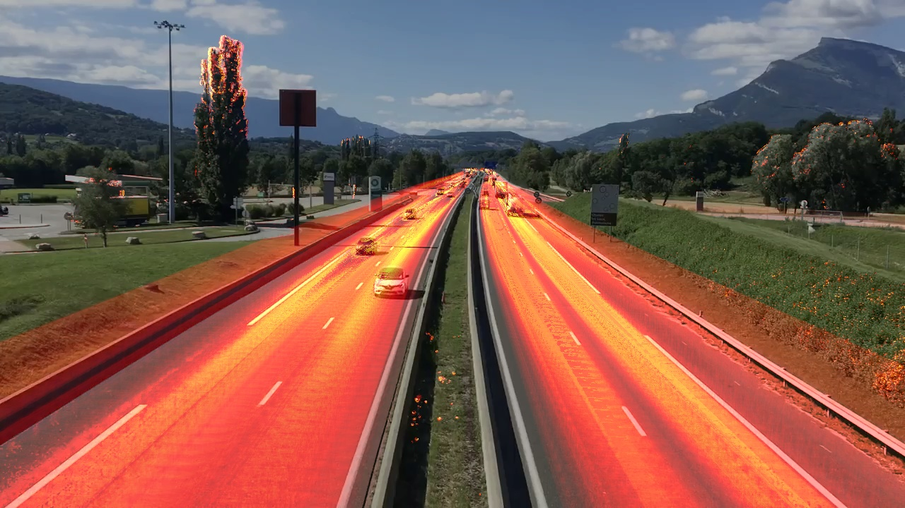

# Motion Heatmap

This application is useful to see movement patterns over time. For example, it could be used to see the usage of entrances to a factory floor over time, or patterns of shoppers in a store.

## Dependencies
  * opencv
  * numpy

You need the extra modules installed for the MOG background subtractor. The easiest way to install it was using:

_pip install opencv-contrib-python_

## Command Format

_$ python motion_heatmap.py [-h] -i INPUT -o OUTPUT_

- INPUT: path to input video
- OUTPUT: path to output image.

## How it works
The main APIs used in OpenCV are:  
* MOG background subtractor (cv2.bgsegm.createBackgroundSubtractorMOG()) - https://docs.opencv.org/3.0-beta/modules/video/doc/motion_analysis_and_object_tracking.html?highlight=createbackgroundsubtractormog#createbackgroundsubtractormog  
* cv2.threshold() - https://docs.opencv.org/3.3.1/d7/d4d/tutorial_py_thresholding.html   
* cv2.add() - https://docs.opencv.org/3.2.0/d0/d86/tutorial_py_image_arithmetics.html  
* cv2.applyColorMap() - https://docs.opencv.org/3.0-beta/modules/imgproc/doc/colormaps.html   
* cv2.addWeighted() - https://docs.opencv.org/3.2.0/d0/d86/tutorial_py_image_arithmetics.html  

The application takes each frame and first applies background subtraction using the cv2.bgsegm.createBackgroundSubtractorMOG() object to create a mask. A threshold is then applied to the mask to remove small amounts of movement, and also to set the accumulation value for each iteration. The result of the threshold is added to an accumulation image (one that starts out at all zero and gets added to each iteration without removing anything), which is what records the motion. At the very end, a color map is applied to the accumulated image so it's easier to see the motion. This colored imaged is then combined with a copy of the first frame using cv2.addWeighted to accomplish the overlay.
